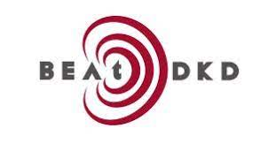

<h1 align="center" style="color:#990000"> Prediction model of future eGFR in people with type 2 diabetes mellitus </h1>

<br>



Code for the development, validation and the [shiny web-application](https://beatdkd.shinyapps.io/shiny/) of the eGFR prediction calculator within the BEAt-DKD project WP1 Task 5.

This repository provides the accompanying code for model building, internal- external validation and external validation. In addition, the code for the web-application using Shiny is available.
<br clear="left"/>


<br>

**Reference:**\
Gregorich, M.,  Kammer, M., Heinzel, A., Böger, C., Eckhardt, K. U., Heerspin, H., Jung, B., Mayer, G., Meiselbach, H., Schmid, M., Schultheiss, U., Heinze, G., & Oberbauer, R. (2023). Development and validation of a prediction model for future eGFR in people with type 2 diabetes mellitus. **(in submission)**


## Contents

- `scr` folder: contains the necessary code files for model building and validation without patient data
- `shiny` folder contains the code files for the Shiny web implementation of the prediction model

## Usage

The predictive model code is included to transparently report the model development and validation, however, it cannot be executed due to the lack of the underlying data of the PROVALID, DIACORE and the GCKD study cohorts.

The shiny app can either be started by downloading the shiny folder and executing the code or can be accessed via [here](https://beatdkd.shinyapps.io/shiny/).

``` r
# install.packages("devtools")
devtools::install_github("mgregorich/BEAt-DKD_PredeGFR")
```


## Prerequisites

The code uses the statistical software `R` (>= 4.0) 

## Acknowledgements

This project has received funding from the Innovative Medicines Initiative 2 Joint Undertaking under grant agreement No 115974. The JU receives support from the European Union’s Horizon 2020 research and innovation programme and EFPIA and JDRF. Any dissemination of results reflects only the author's view; the JU is not responsible for any use that may be made of the information it contains.  A full list of BeatDKD partners may be found on the website (https://www.beat-dkd.eu/). 
